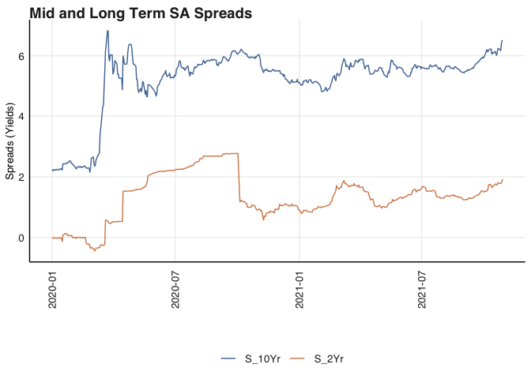
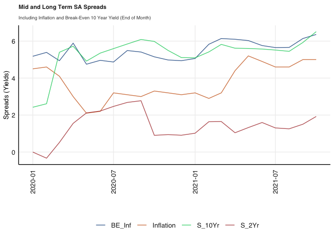
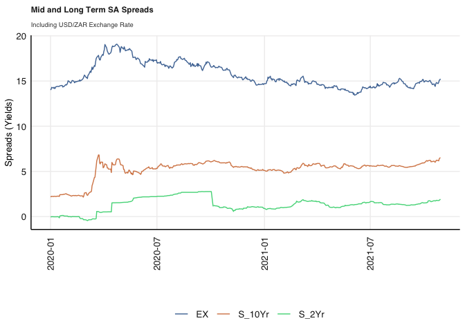
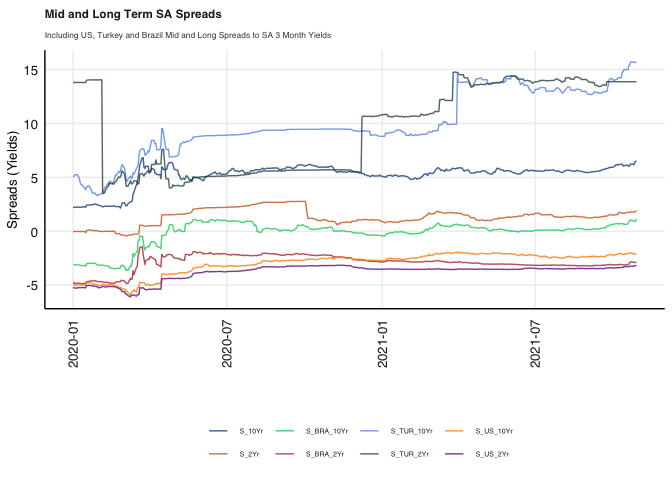
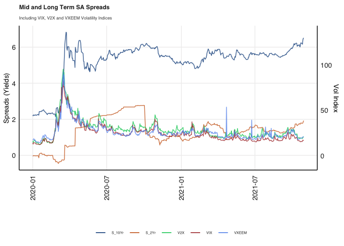
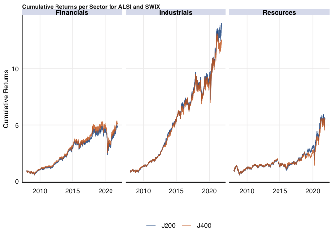
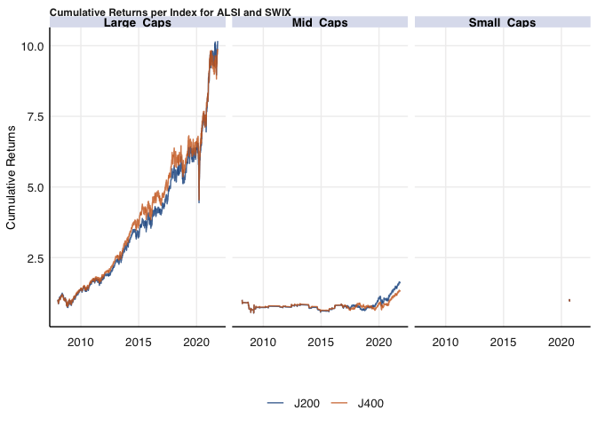
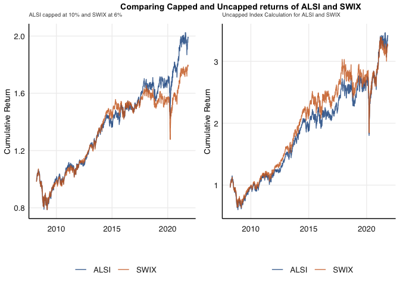

# Description

This is the README for the Financial Econometrics Practical Exam.

This folder was created by running on an R instance:

``` r
fmxdat::make_project()
```

All the folder structure for all questions was made using the following
code:

``` r
# Question 1
Texevier::create_template_html(directory = "Questions",
                          template_name = "Question1"
)

# Question 2
Texevier::create_template(directory = "Questions",
                          template_name = "Question2"
)
```

Source in all functions (This may not be necessary)

``` r
rm(list = ls()) # Clean your environment:
gc() # garbage collection - It can be useful to call gc after a large object has been removed, as this may prompt R to return memory to the operating system.
```

    ##          used (Mb) gc trigger (Mb) limit (Mb) max used (Mb)
    ## Ncells 423743 22.7     877231 46.9         NA   666925 35.7
    ## Vcells 806034  6.2    8388608 64.0     102400  1823999 14.0

``` r
library(tidyverse)
```

    ## ── Attaching packages ─────────────────────────────────────── tidyverse 1.3.1 ──

    ## ✓ ggplot2 3.3.5     ✓ purrr   0.3.4
    ## ✓ tibble  3.1.4     ✓ dplyr   1.0.7
    ## ✓ tidyr   1.1.3     ✓ stringr 1.4.0
    ## ✓ readr   2.0.1     ✓ forcats 0.5.1

    ## ── Conflicts ────────────────────────────────────────── tidyverse_conflicts() ──
    ## x dplyr::filter() masks stats::filter()
    ## x dplyr::lag()    masks stats::lag()

``` r
pacman::p_load(cowplot)
list.files('code/', full.names = T, recursive = T) %>% .[grepl('.R', .)] %>% as.list() %>% walk(~source(.))
```

# Question 1

## Yield Spreads

``` r
# Read in Data

library(tidyverse)
SA_bonds <- read_rds("data/SA_Bonds.rds")
BE_Infl <- read_rds("data/BE_Infl.rds")
bonds_2y <- read_rds("data/bonds_2y.rds")
bonds_10y <- read_rds("data/bonds_10y.rds")
usdzar <- read_rds("data/usdzar.rds")
ZA_Infl <- read_rds("data/ZA_Infl.rds")
IV <- read_rds("data/IV.rds")
```

-   Compare returns for short term debt to mid and long term debt.

``` r
pacman::p_load(fmxdat)

# Make data longer, calculate returns, filter to 2020 onwards and calculate mid and long term spreads.

SA_Spreads <- SA_bonds %>% 
    arrange(date) %>% 
    group_by(date) %>% 
    mutate(S_2Yr = ZA_2Yr-SA_3M, S_10Yr = ZA_10Yr-SA_3M) %>% 
    ungroup() %>% 
    pivot_longer(c("S_2Yr", "S_10Yr"), names_to = "Spreads", values_to = "Rates") %>% 
    filter(date >= as.Date("2020/01/01"))
    
# Plot the spreads

q1_p1 <- SA_Spreads %>% 
    ggplot() +
    geom_line(aes(date, Rates, colour = Spreads), alpha = 0.8) +
    labs(title = "Mid and Long Term SA Spreads", y = "Spreads (Yields)", x ="") +
    fmxdat::theme_fmx() + 
    fmxdat::fmx_cols()

fmxdat::finplot(q1_p1, x.date.type = "%Y%m", x.vert = TRUE)
```



-   Find real rates using inflation.

``` r
pacman::p_load(lubridate)

# Calculate Spreads and Inflation
# Take end of Month Yields

SA_Spreads_Infl <- left_join(SA_bonds %>% filter(date >= as.Date("2020/01/01")) %>% 
    arrange(date) %>% 
    group_by(date) %>% 
    mutate(S_2Yr = ZA_2Yr-SA_3M, S_10Yr = ZA_10Yr-SA_3M), 
    BE_Infl %>% rename(BE_Inf = Price) %>% 
        select(-Name) %>%  
        filter(date >= as.Date("2020/01/01")), by = "date") %>% 
    mutate(YM = format(date, "%Y%m")) %>% 
    group_by(YM) %>% 
    filter(date == last(date)) %>% 
    select(-date) %>% 
    left_join(.,
    ZA_Infl %>% 
        arrange(date) %>% 
        filter(date >= as.Date("2020/01/01")) %>% 
        rename(Inflation = Price) %>% 
        select(-Name) %>% 
        mutate(YM = format(date, "%Y%m")) %>% 
        select(-date),
    by = "YM") %>% 
    ungroup() %>% 
    pivot_longer(c("S_2Yr", "S_10Yr", "BE_Inf", "Inflation"), names_to = "Spreads", values_to = "Rates") %>% 
    mutate(date = ym(YM))


# Plot the spreads and inflation

q1_p2 <- SA_Spreads_Infl %>% 
    ggplot() +
    geom_line(aes(date, Rates, colour = Spreads), alpha = 0.8) +
    labs(title = "Mid and Long Term SA Spreads", y = "Spreads (Yields)", x ="", subtitle = "Including Inflation and Break-Even 10 Year Yield (End of Month)") +
    fmxdat::theme_fmx(title.size = ggpts(25), subtitle.size = ggpts(20)) + 
    fmxdat::fmx_cols()

fmxdat::finplot(q1_p2, x.date.type = "%Y%m", x.vert = TRUE)
```



-   Compare to USD/ZAR, see if higher exchange rate means less
    confidence and higher spreads

``` r
# Show Spreads and Exchange Rate

SA_Spreads_EX <- SA_bonds %>% 
    arrange(date) %>% 
    group_by(date) %>% 
    mutate(S_2Yr = ZA_2Yr-SA_3M, S_10Yr = ZA_10Yr-SA_3M) %>% 
    ungroup() %>% 
    filter(date >= as.Date("2020/01/01")) %>% 
    left_join(., usdzar %>% 
                  arrange(date) %>% 
                  filter(date >= as.Date("2020/01/01")) %>% 
                  rename(EX = Price)%>% 
                  select(-Name), by = "date") %>% 
    pivot_longer(c("S_2Yr", "S_10Yr", "EX"), names_to = "Spreads", values_to = "Rates") 

# Plot the spreads

q1_p3 <- SA_Spreads_EX %>% 
    ggplot() +
    geom_line(aes(date, Rates, colour = Spreads), alpha = 0.8) +
    labs(title = "Mid and Long Term SA Spreads", y = "Spreads (Yields)", x ="", subtitle = "Including USD/ZAR Exchange Rate") +
    fmxdat::theme_fmx(title.size = ggpts(25), subtitle.size = ggpts(20)) + 
    fmxdat::fmx_cols()

fmxdat::finplot(q1_p3, x.date.type = "%Y%m", x.vert = TRUE)
```



-   Compare to International Spreads

``` r
# Calculate SA Spreads and US, Turkey and Brazil Spreads with SA 3 Month Yields

names_2yr <- c("Brazil_2yr", "US_2yr", "TUR_2yr")
names_10yr <- c("Brazil_10Yr", "US_10Yr", "TUR_10Yr")


SA_Spreads_Int <- SA_bonds %>% 
    arrange(date) %>% 
    group_by(date) %>% 
    ungroup() %>% 
    filter(date >= as.Date("2020/01/01")) %>% 
    left_join(., bonds_2y %>% 
                  arrange(date) %>% 
                  filter(date >= as.Date("2020/01/01")) %>% 
                  filter(Name %in% names_2yr) %>% 
                  spread(Name, Bond_2Yr), by = "date") %>% 
    left_join(., bonds_10y %>% 
                  arrange(date) %>% 
                  filter(date >= as.Date("2020/01/01")) %>% 
                  filter(Name %in% names_10yr) %>% 
                  spread(Name, Bond_10Yr), by = "date") %>% 
    group_by(date) %>% 
    mutate(S_2Yr = ZA_2Yr-SA_3M, S_10Yr = ZA_10Yr-SA_3M, 
           S_US_2Yr = US_2yr-SA_3M, S_US_10Yr = US_10Yr-SA_3M, 
           S_TUR_10Yr = TUR_10Yr-SA_3M, S_TUR_2Yr = TUR_2yr-SA_3M,
           S_BRA_10Yr = Brazil_10Yr-SA_3M, S_BRA_2Yr = Brazil_2yr-SA_3M) %>% 
    ungroup() %>% 
    pivot_longer(c("S_2Yr", "S_10Yr", 
                   "S_US_2Yr", "S_US_10Yr", 
                   "S_TUR_10Yr", "S_TUR_2Yr", 
                   "S_BRA_10Yr", "S_BRA_2Yr"), 
                 names_to = "Spreads", values_to = "Rates") 

# Plot the spreads

q1_p4 <- SA_Spreads_Int %>% filter(!Spreads %in% "S_AUS_2Yr") %>% 
    ggplot() +
    geom_line(aes(date, Rates, colour = Spreads), alpha = 0.8) +
    labs(title = "Mid and Long Term SA Spreads", y = "Spreads (Yields)", x ="", subtitle = "Including US, Turkey and Brazil Mid and Long Spreads to SA 3 Month Yields") +
    fmxdat::theme_fmx(title.size = ggpts(25), subtitle.size = ggpts(18), legend.size = ggpts(15)) + 
    fmxdat::fmx_cols()

fmxdat::finplot(q1_p4, x.date.type = "%Y%m", x.vert = TRUE)
```



``` r
# Compare SA Spreads to VIX

SA_Spreads_Int_VIX <- SA_bonds %>% 
    arrange(date) %>% 
    group_by(date) %>% 
    ungroup() %>% 
    filter(date >= as.Date("2020/01/01")) %>% 
    left_join(., IV %>% filter(date >= as.Date("2020/01/01")) %>% 
    spread(Name, Price), by = "date") %>% 
    mutate(S_2Yr = ZA_2Yr-SA_3M, S_10Yr = ZA_10Yr-SA_3M) %>% 
    pivot_longer(c("S_2Yr", "S_10Yr"), names_to = "Spreads", values_to = "Rates") %>% 
    pivot_longer(c("V2X", "VIX", "VXEEM"), names_to = "Vol", values_to = "Index")

# PLot Spreads and Indices on Seperate Axis

q1_p5 <- SA_Spreads_Int_VIX %>% 
    ggplot() +
    geom_line(aes(date, Rates, colour = Spreads), alpha = 0.8) +
    geom_line(aes(date, Index/20, colour = Vol), alpha = 0.8) +
    ggplot2::scale_y_continuous(
    name = "Spreads (Yields)",
    sec.axis = sec_axis(~.*20, name="Vol Index")) +
     labs(title = "Mid and Long Term SA Spreads", x ="", subtitle = "Including VIX, V2X and VXEEM Volatility Indices") +
    fmxdat::theme_fmx(title.size = ggpts(25), subtitle.size = ggpts(18), legend.size = ggpts(15)) + 
    fmxdat::fmx_cols()

fmxdat::finplot(q1_p5, x.date.type = "%Y%m", x.vert = TRUE)
```



# Question 2

-   Load in data

``` r
# Loading in data

T40 <- read_rds("data/T40.rds")
RebDays <- read_rds("data/Rebalance_days.rds")
```

-   Create function to calculate portfolio returns for different sectors
    and indices for both SWIX and ALSI.

``` r
# Create portfolio return function

# Sector and Index as input
# Portfolio returns for both SWIX and ALSI as output

pacman::p_load(tbl2xts, PerformanceAnalytics)

port_ret_func <- function(data = T40, sector = "", index = ""){
    fund <- data
    
    if(!sector == ""){
        fund <- data %>% filter(Sector %in% sector) %>% 
            group_by(date) %>% 
            mutate(J400 = J400/sum(J400, na.rm = TRUE), J200 = J200/sum(J200, na.rm = TRUE)) %>% 
            ungroup()
    } 
    if(!index == ""){
        fund <- data %>% filter(Index_Name %in% index) %>% 
            group_by(date) %>% 
            mutate(J400 = J400/sum(J400, na.rm = TRUE), J200 = J200/sum(J200, na.rm = TRUE)) %>% 
            ungroup()
    } 
    if(!sector == "" & !index == ""){
        fund <- data %>%
            group_by(date) %>% 
            mutate(J400 = J400/sum(J400, na.rm = TRUE), J200 = J200/sum(J200, na.rm = TRUE)) %>% 
            ungroup()
    }
    
    fund_J200_weights <- fund %>% select(date, Tickers, J200) %>% mutate(J200 = coalesce(J200, 0)) %>%
        spread(Tickers, J200) %>% 
        tbl_xts()
    fund_J200_weights[is.na(fund_J200_weights)] <- 0
    
    fund_J400_weights <- fund %>% select(date, Tickers, J400) %>% spread(Tickers, J400) %>% tbl_xts()
    fund_J400_weights[is.na(fund_J400_weights)] <- 0
    
    fund_returns <- fund %>% select(date, Tickers, Return) %>% spread(Tickers, Return)
    fund_returns[is.na(fund_returns)] <- 0
    fund_returns_xts <- fund_returns %>% tbl_xts()
    
    J200_RetPort <- rmsfuns::Safe_Return.portfolio(fund_returns_xts,
    weights = fund_J200_weights, lag_weights = TRUE,
    contribution = TRUE, verbose = TRUE,
    value = 1, geometric = TRUE)
    
    J400_RetPort <- rmsfuns::Safe_Return.portfolio(R = fund_returns_xts,
    weights = fund_J400_weights, lag_weights = TRUE,
    contribution = TRUE, verbose = TRUE,
    value = 1000, geometric = TRUE)
    
    # Clean and save portfolio returns and weights:
    J200_Contribution <- J200_RetPort$"contribution" %>% xts_tbl() %>%
        mutate(date = lag(date), date = coalesce(date, index(fund_J200_weights)[1]) )

    J200_BPWeight <- J200_RetPort$"BOP.Weight" %>% xts_tbl() %>%
        mutate(date = lag(date), date = coalesce(date, index(fund_J200_weights)[1]) )
    
    J200_BPValue <- J200_RetPort$"BOP.Value" %>% xts_tbl() %>% 
        mutate(date = lag(date), date = coalesce(date, index(fund_J200_weights)[1]) )
    
        # Clean and save portfolio returns and weights:
    J400_Contribution <- J400_RetPort$"contribution" %>% xts_tbl() %>%
        mutate(date = lag(date), date = coalesce(date, index(fund_J400_weights)[1]) )
    
    J400_BPWeight <- J400_RetPort$"BOP.Weight" %>% xts_tbl() %>%
        mutate(date = lag(date), date = coalesce(date, index(fund_J400_weights)[1]) )
    
    J400_BPValue <- J400_RetPort$"BOP.Value" %>% xts_tbl() %>% 
        mutate(date = lag(date), date = coalesce(date, index(fund_J400_weights)[1]) )


names(J200_Contribution) <- c("date", names(J200_RetPort$"contribution"))
names(J200_BPWeight) <- c("date", names(J200_RetPort$"BOP.Weight"))
names(J200_BPValue) <- c("date", names(J200_RetPort$"BOP.Value"))
names(J400_Contribution) <- c("date", names(J400_RetPort$"contribution"))
names(J400_BPWeight) <- c("date", names(J400_RetPort$"BOP.Weight"))
names(J400_BPValue) <- c("date", names(J400_RetPort$"BOP.Value"))

# Let's bind all of these together now:
df_port_return_J200 <-
left_join(fund %>% select(date, Tickers, Return),
J200_BPWeight %>% gather(Tickers, weight, -date),
by = c("date", "Tickers") ) %>%
left_join(.,
J200_BPValue %>% gather(Tickers, value_held, -date),
by = c("date", "Tickers") ) %>%
left_join(.,
J200_Contribution %>% gather(Tickers, Contribution, -date),
by = c("date", "Tickers"))

df_port_return_J400 <-
left_join(fund %>% select(date, Tickers, Return),
J400_BPWeight %>% gather(Tickers, weight, -date),
by = c("date", "Tickers") ) %>%
left_join(.,
J400_BPValue %>% gather(Tickers, value_held, -date),
by = c("date", "Tickers") ) %>%
left_join(.,
J400_Contribution %>% gather(Tickers, Contribution, -date),
by = c("date", "Tickers"))

# Calculate Portfolio Returns:
df_Portf_J200<- df_port_return_J200 %>% group_by(date) %>% summarise(PortfolioReturn = sum(Return*weight, na.rm = TRUE)) %>% 
filter(PortfolioReturn != 0)
# Calculate Portfolio Returns:
df_Portf_J400 <-
df_port_return_J400 %>% group_by(date) %>% summarise(PortfolioReturn = sum(Return*weight, na.rm = TRUE)) %>% filter(PortfolioReturn != 0)
    
out <- left_join(df_Portf_J200 %>% rename(J200 = PortfolioReturn), 
                 df_Portf_J400 %>%  rename(J400 = PortfolioReturn), by = "date") %>% 
    pivot_longer(c("J200", "J400"), names_to = "Meth", values_to = "Returns")
out
}
```

``` r
# Compare Sectors for ALSI and SWIX

sectors <- T40 %>% pull(Sector) %>% unique()
sector_ret <- list()

for(i in 1:length(sectors)){
    # Loop through sectors and calculate returns and cumulative returns
    sector_ret[[i]] <- port_ret_func(T40, sector = sectors[i]) %>% group_by(Meth) %>% 
    mutate(cumreturn_Rand = (cumprod(1 + 
    Returns))) %>% # Start at 1
mutate(cumreturn_Rand = cumreturn_Rand/first(cumreturn_Rand)) %>% 
    mutate(Sector = sectors[i])
}
# Rename tibbles
names(sector_ret) <- sectors
# Combine Dataframes

sectors_cum_ret <- rbind(sector_ret[[1]],
                             sector_ret[[2]], 
                             sector_ret[[3]]) %>% arrange(date)
    
q2_p1 <- sectors_cum_ret %>% 
        ggplot() +
        geom_line(aes(date, cumreturn_Rand, colour = Meth), alpha = 0.8) + facet_wrap(~Sector) + fmxdat::fmx_cols() + 
        labs(title = "Cumulative Returns per Sector for ALSI and SWIX", y = "Cumulative Returns", x = "") +
        fmxdat::theme_fmx(title.size = ggpts(25))

finplot(q2_p1)
```



``` r
# Compare indeices for ALSI and SWIX

indices <- T40 %>%  pull(Index_Name) %>% na.omit(.) %>%  unique()
indices_ret <- list()

for(i in 1:length(indices)){
    # Loop through sectors and calculate returns and cumulative returns
    indices_ret[[i]] <- port_ret_func(T40,index = indices[i]) %>% group_by(Meth) %>% 
    mutate(cumreturn_Rand = (cumprod(1 + 
    Returns))) %>% # Start at 1
mutate(cumreturn_Rand = cumreturn_Rand/first(cumreturn_Rand)) %>% 
    mutate(Index = indices[i])
}
# Rename tibbles
names(indices_ret) <- indices
# Combine Dataframes

indices_cum_ret <- rbind(indices_ret[[1]],
                             indices_ret[[2]], 
                             indices_ret[[3]]) %>% arrange(date)
    
q2_p2 <- indices_cum_ret %>% 
        ggplot() +
        geom_line(aes(date, cumreturn_Rand, colour = Meth), alpha = 0.8) + facet_wrap(~Index) + fmxdat::fmx_cols() + 
        labs(title = "Cumulative Returns per Index for ALSI and SWIX", y = "Cumulative Returns", x = "") +
        fmxdat::theme_fmx(title.size = ggpts(25))

finplot(q2_p2)
```



``` r
# Stratify the returns by high and low volatility of the UDS ZAR and compare ALSI and SWIX
usdzar
```

    ## # A tibble: 8,305 × 3
    ##    date       Name             Price
    ##    <date>     <chr>            <dbl>
    ##  1 1990-01-01 SouthAfrica_Cncy  2.55
    ##  2 1990-01-02 SouthAfrica_Cncy  2.57
    ##  3 1990-01-03 SouthAfrica_Cncy  2.58
    ##  4 1990-01-04 SouthAfrica_Cncy  2.53
    ##  5 1990-01-05 SouthAfrica_Cncy  2.54
    ##  6 1990-01-08 SouthAfrica_Cncy  2.53
    ##  7 1990-01-09 SouthAfrica_Cncy  2.54
    ##  8 1990-01-10 SouthAfrica_Cncy  2.54
    ##  9 1990-01-11 SouthAfrica_Cncy  2.54
    ## 10 1990-01-12 SouthAfrica_Cncy  2.54
    ## # … with 8,295 more rows

``` r
zar <-  usdzar  %>% 
  filter(date > ymd(20080101)) %>% 
    mutate(Return = Price/lag(Price) - 1) %>% filter(date > first(date)) %>% 
    select(-c(Price, Name))

ZARSD <- 
  
zar %>% 
  
  mutate(YearMonth = format(date, "%Y%B")) %>% 
  
  group_by(YearMonth) %>% summarise(SD = sd(Return)*sqrt(52)) %>% 
  
  # Top Decile Quantile overall (highly volatile month for ZAR:
  mutate(TopQtile = quantile(SD, 0.8),
         
         BotQtile = quantile(SD, 0.2))

Hi_Vol <- ZARSD %>% filter(SD > TopQtile) %>% pull(YearMonth)

Low_Vol <- ZARSD %>% filter(SD < BotQtile) %>% pull(YearMonth)

# Create generic function to compare performance:

Perf_comparisons <- function(Idxs, YMs, Alias){
  # For stepping through uncomment:
  # YMs <- Hi_Vol
  Unconditional_SD <- 
    
  Idxs %>% 
    
    group_by(Tickers) %>% 
    
    mutate(Full_SD = sd(Return) * sqrt(252)) %>% 
    
    filter(YearMonth %in% YMs) %>% 
    
    summarise(SD = sd(Return) * sqrt(252), across(.cols = starts_with("Full"), .fns = max)) %>% 
    
    arrange(desc(SD)) %>% mutate(Period = Alias) %>% 
    
    group_by(Tickers) %>% 
    
    mutate(Ratio = SD / Full_SD)
    
    Unconditional_SD
  
}

ALSI_SWIX <- port_ret_func(T40)
# Prepare and Winzorise Returns
ALSI_SWIX <- ALSI_SWIX %>% 
    group_by(Meth) %>% 
    mutate(YearMonth = format(date, "%Y%B")) %>% 
    rename(Tickers = Meth, Return = Returns) %>% 
    group_by(Tickers) %>% 
    mutate(Top = quantile(Return, 0.99), Bot = quantile(Return, 0.01)) %>% 
    mutate(Return = ifelse(Return > Top, Top, 
                         ifelse(Return < Bot, Bot, Return))) %>% ungroup()

perf_hi <- Perf_comparisons(ALSI_SWIX, YMs = Hi_Vol, Alias = "High_Vol")

perf_lo <- Perf_comparisons(ALSI_SWIX, YMs = Low_Vol, Alias = "Low_Vol")

# Print High Vol
perf_hi
```

    ## # A tibble: 2 × 5
    ## # Groups:   Tickers [2]
    ##   Tickers    SD Full_SD Period   Ratio
    ##   <chr>   <dbl>   <dbl> <chr>    <dbl>
    ## 1 J200    0.288   0.194 High_Vol  1.48
    ## 2 J400    0.286   0.194 High_Vol  1.48

``` r
# Print Low Low
perf_lo
```

    ## # A tibble: 2 × 5
    ## # Groups:   Tickers [2]
    ##   Tickers    SD Full_SD Period  Ratio
    ##   <chr>   <dbl>   <dbl> <chr>   <dbl>
    ## 1 J400    0.154   0.194 Low_Vol 0.793
    ## 2 J200    0.151   0.194 Low_Vol 0.779

``` r
# Construct Capped Portfolio and Determine Performance for ALSI

reb_ALSI <- T40 %>% 
filter(date %in% RebDays$date) %>% 
# Now we have to distinguish rebalances - to create something
# to group by:
mutate(RebalanceTime = format(date, "%Y%B")) %>% 
    select(date, Tickers, Return, J200, RebalanceTime) %>% 
    rename(weight = J200) %>% 
    mutate(weight = coalesce(weight , 0))

## Uncomment for stepping through function:
# df_Cons <- rebalance_col %>% filter(date == first(date))
# W_Cap = 0.08

Proportional_Cap_Foo <- function(df_Cons, W_Cap = 0.08){
  
  # Let's require a specific form from the user... Alerting when it does not adhere this form
  if( !"weight" %in% names(df_Cons)) stop("... for Calc capping to work, provide weight column called 'weight'")
  
  if( !"date" %in% names(df_Cons)) stop("... for Calc capping to work, provide date column called 'date'")
  
  if( !"Tickers" %in% names(df_Cons)) stop("... for Calc capping to work, provide id column called 'Tickers'")

  # First identify the cap breachers...
  Breachers <- 
    df_Cons %>% filter(weight > W_Cap) %>% pull(Tickers)
  
  # Now keep track of breachers, and add to it to ensure they remain at 10%:
  if(length(Breachers) > 0) {
    
    while( df_Cons %>% filter(weight > W_Cap) %>% nrow() > 0 ) {
      
      
      df_Cons <-
        
        bind_rows(
          
          df_Cons %>% filter(Tickers %in% Breachers) %>% mutate(weight = W_Cap),
          
          df_Cons %>% filter(!Tickers %in% Breachers) %>% 
            mutate(weight = (weight / sum(weight, na.rm=T)) * (1-length(Breachers)*W_Cap) )
          
        )
      
      Breachers <- c(Breachers, df_Cons %>% filter(weight > W_Cap) %>% pull(Tickers))
      
    }

    if( sum(df_Cons$weight, na.rm=T) > 1.1 | sum(df_Cons$weight, na.rm=T) < 0.9 | max(df_Cons$weight, na.rm = T) > W_Cap) {
      
      stop( glue::glue("For the Generic weight trimming function used: the weight trimming causes non unit 
      summation of weights for date: {unique(df_Cons$date)}...\n
      The restriction could be too low or some dates have extreme concentrations...") )
      
    }
    
  } else {
    
  }
  
  df_Cons
  
  }
  
# Apply Proportional_Cap_Foo to ALSI to get capped return for cap of 10%
Capped_df <- 
reb_ALSI %>% 
group_split(RebalanceTime) %>% 
map_df(~Proportional_Cap_Foo(., W_Cap = 0.1) ) %>% select(-RebalanceTime)
 
ALSI_wts <- Capped_df %>% tbl_xts(cols_to_xts = weight, spread_by = Tickers)

ALSI_rts <- T40 %>% 
filter(Tickers %in% unique(Capped_df$Tickers)) %>% 
tbl_xts(cols_to_xts = Return, spread_by = Tickers)

ALSI_wts[is.na(ALSI_wts)] <- 0

ALSI_rts[is.na(ALSI_rts)] <- 0

ALSI_capped <- rmsfuns::Safe_Return.portfolio(R = ALSI_rts, weights = ALSI_wts, 
    lag_weights = T) %>% 
xts_tbl() %>% 
rename(ALSI = portfolio.returns)

# Construct Capped Portfolio and Determine Performance for SWIX

reb_SWIX <- T40 %>% 
filter(date %in% RebDays$date) %>% 
mutate(RebalanceTime = format(date, "%Y%B")) %>% 
    select(date, Tickers, Return, J400, RebalanceTime) %>% 
    rename(weight = J400) %>% 
    mutate(weight = coalesce(weight , 0))
  
# Apply Proportional_Cap_Foo to ALSI to get capped return for cap of 6%
Capped_df <- 
reb_SWIX %>% 
group_split(RebalanceTime) %>% 
map_df(~Proportional_Cap_Foo(., W_Cap = 0.06) ) %>% select(-RebalanceTime)
 
SWIX_wts <- Capped_df %>% tbl_xts(cols_to_xts = weight, spread_by = Tickers)

SWIX_rts <- T40 %>% 
filter(Tickers %in% unique(Capped_df$Tickers)) %>% 
tbl_xts(cols_to_xts = Return, spread_by = Tickers)

SWIX_wts[is.na(SWIX_wts)] <- 0

SWIX_rts[is.na(SWIX_rts)] <- 0

SWIX_capped <- rmsfuns::Safe_Return.portfolio(R = SWIX_rts, weights = SWIX_wts, 
    lag_weights = T) %>% 
xts_tbl() %>% 
rename(SWIX = portfolio.returns)


# Combine and Plot Performance

capped_indices <- left_join(ALSI_capped, SWIX_capped, by = "date") %>% 
    pivot_longer(c("ALSI", "SWIX"), names_to = "Meth", values_to = "returns")

# Calculate Uncapped Return for ALSI
ALSI_wts <- T40 %>% 
filter(date %in% RebDays$date) %>% 
mutate(RebalanceTime = format(date, "%Y%B")) %>% 
    rename(weight = J200) %>% 
    mutate(weight = coalesce(weight , 0)) %>% 
    select(date, Tickers, Return, weight, RebalanceTime) %>% 
     tbl_xts(cols_to_xts = weight, spread_by = Tickers)

ALSI_wts[is.na(ALSI_wts)] <- 0

ALSI_rts[is.na(ALSI_rts)] <- 0

ALSI_capped <- rmsfuns::Safe_Return.portfolio(R = ALSI_rts, weights = ALSI_wts, 
    lag_weights = T) %>% 
xts_tbl() %>% 
rename(ALSI = portfolio.returns)

# Calculate Uncapped Return for SWIX
 
SWIX_wts <- T40 %>% 
filter(date %in% RebDays$date) %>% 
mutate(RebalanceTime = format(date, "%Y%B")) %>% 
    rename(weight = J400) %>% 
    mutate(weight = coalesce(weight , 0)) %>% 
    select(date, Tickers, Return, weight, RebalanceTime) %>% 
     tbl_xts(cols_to_xts = weight, spread_by = Tickers)

SWIX_wts[is.na(SWIX_wts)] <- 0

SWIX_rts[is.na(SWIX_rts)] <- 0

SWIX_capped <- rmsfuns::Safe_Return.portfolio(R = SWIX_rts, weights = SWIX_wts, 
    lag_weights = T) %>% 
xts_tbl() %>% 
rename(SWIX = portfolio.returns)

# Combine and Plot

ALSI_SWIX <- left_join(ALSI_capped, SWIX_capped, by = "date") %>% 
    pivot_longer(c("ALSI", "SWIX"), names_to = "Meth", values_to = "Returns")

q2_p3 <- capped_indices %>% 
    group_by(Meth) %>%
    mutate(Idx = cumprod(1 + returns)) %>% 
ggplot() + 
geom_line(aes(date, Idx, colour = Meth), alpha = 0.8) + 
labs(subtitle = "ALSI capped at 10% and SWIX at 6%", 
    x = "", y = "Cumulative Return") + 
    fmx_cols() + 
fmxdat::theme_fmx(subtitle.size = ggpts(20))

q2_p4 <- ALSI_SWIX %>% 
    group_by(Meth) %>%
    mutate(Idx = cumprod(1 + Returns)) %>% 
ggplot() + 
geom_line(aes(date, Idx, colour = Meth), alpha = 0.8) + 
labs(subtitle = "Uncapped Index Calculation for ALSI and SWIX", 
    x = "", y = "Cumulative Return") + 
    fmx_cols() + 
fmxdat::theme_fmx(subtitle.size = ggpts(20))

plot_grid(finplot(q2_p3), finplot(q2_p4), labels = list(title = "Comparing Capped and Uncapped returns of ALSI and SWIX"), label_size = ggpts(30), align = "h")
```


