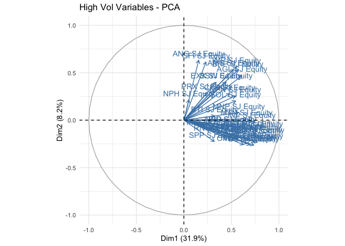

# Description

This is the README for the Financial Econometrics Practical Exam.

This folder was created by running on an R instance:

``` r
fmxdat::make_project()
```

All the folder structure for all questions was made using the following
code:

``` r
# Question 1
Texevier::create_template_html(directory = "Questions",
                          template_name = "Question1"
)

# Question 2
Texevier::create_template(directory = "Questions",
                          template_name = "Question2"
)

# Question 3
Texevier::create_template_html(directory = "Questions",
                          template_name = "Question3"
)

# Question 4
Texevier::create_template(directory = "Questions",
                          template_name = "Question4"
)

# Question 5
Texevier::create_template_html(directory = "Questions",
                          template_name = "Question5"
)
```

Source in all functions (This may not be necessary)

``` r
rm(list = ls()) # Clean your environment:
gc() # garbage collection - It can be useful to call gc after a large object has been removed, as this may prompt R to return memory to the operating system.
```

    ##          used (Mb) gc trigger (Mb) limit (Mb) max used (Mb)
    ## Ncells 424494 22.7     879377   47         NA   666925 35.7
    ## Vcells 811877  6.2    8388608   64     102400  1823999 14.0

``` r
library(tidyverse)
```

    ## ── Attaching packages ─────────────────────────────────────── tidyverse 1.3.1 ──

    ## ✓ ggplot2 3.3.5     ✓ purrr   0.3.4
    ## ✓ tibble  3.1.4     ✓ dplyr   1.0.7
    ## ✓ tidyr   1.1.3     ✓ stringr 1.4.0
    ## ✓ readr   2.0.1     ✓ forcats 0.5.1

    ## ── Conflicts ────────────────────────────────────────── tidyverse_conflicts() ──
    ## x dplyr::filter() masks stats::filter()
    ## x dplyr::lag()    masks stats::lag()

``` r
pacman::p_load(cowplot, glue)
list.files('code/', full.names = T, recursive = T) %>% .[grepl('.R', .)] %>% as.list() %>% walk(~source(.))
```

# Question 1

## Yield Spreads

``` r
# Read in Data

library(tidyverse)
SA_bonds <- read_rds("data/SA_Bonds.rds")
BE_Infl <- read_rds("data/BE_Infl.rds")
bonds_2y <- read_rds("data/bonds_2y.rds")
bonds_10y <- read_rds("data/bonds_10y.rds")
usdzar <- read_rds("data/usdzar.rds")
ZA_Infl <- read_rds("data/ZA_Infl.rds")
IV <- read_rds("data/IV.rds")
```

-   Compare returns for short term debt to mid and long term debt.

``` r
pacman::p_load(fmxdat)

# Make data longer, calculate returns, filter to 2020 onwards and calculate mid and long term spreads.

SA_Spreads <- SA_bonds %>% 
    arrange(date) %>% 
    group_by(date) %>% 
    mutate(S_2Yr = ZA_2Yr-SA_3M, S_10Yr = ZA_10Yr-SA_3M) %>% 
    ungroup() %>% 
    pivot_longer(c("S_2Yr", "S_10Yr"), names_to = "Spreads", values_to = "Rates") %>% 
    filter(date >= as.Date("2020/01/01"))
    
# Plot the spreads

q1_p1 <- SA_Spreads %>% 
    ggplot() +
    geom_line(aes(date, Rates, colour = Spreads), alpha = 0.8) +
    labs(title = "Mid and Long Term SA Spreads", y = "Spreads (Yields)", x ="") +
    fmxdat::theme_fmx() + 
    fmxdat::fmx_cols()

fmxdat::finplot(q1_p1, x.date.type = "%Y%m", x.vert = TRUE)
```


-   Find real rates using inflation.

``` r
pacman::p_load(lubridate)

# Calculate Spreads and Inflation
# Take end of Month Yields

SA_Spreads_Infl <- left_join(SA_bonds %>% filter(date >= as.Date("2020/01/01")) %>% 
    arrange(date) %>% 
    group_by(date) %>% 
    mutate(S_2Yr = ZA_2Yr-SA_3M, S_10Yr = ZA_10Yr-SA_3M), 
    BE_Infl %>% rename(BE_Inf = Price) %>% 
        select(-Name) %>%  
        filter(date >= as.Date("2020/01/01")), by = "date") %>% 
    mutate(YM = format(date, "%Y%m")) %>% 
    group_by(YM) %>% 
    filter(date == last(date)) %>% 
    select(-date) %>% 
    left_join(.,
    ZA_Infl %>% 
        arrange(date) %>% 
        filter(date >= as.Date("2020/01/01")) %>% 
        rename(Inflation = Price) %>% 
        select(-Name) %>% 
        mutate(YM = format(date, "%Y%m")) %>% 
        select(-date),
    by = "YM") %>% 
    ungroup() %>% 
    pivot_longer(c("S_2Yr", "S_10Yr", "BE_Inf", "Inflation"), names_to = "Spreads", values_to = "Rates") %>% 
    mutate(date = ym(YM))


# Plot the spreads and inflation

q1_p2 <- SA_Spreads_Infl %>% 
    ggplot() +
    geom_line(aes(date, Rates, colour = Spreads), alpha = 0.8) +
    labs(title = "Mid and Long Term SA Spreads", y = "Spreads (Yields)", x ="", subtitle = "Including Inflation and Break-Even 10 Year Yield (End of Month)") +
    fmxdat::theme_fmx(title.size = ggpts(25), subtitle.size = ggpts(20)) + 
    fmxdat::fmx_cols()

fmxdat::finplot(q1_p2, x.date.type = "%Y%m", x.vert = TRUE)
```


-   Compare to USD/ZAR, see if higher exchange rate means less
    confidence and higher spreads

``` r
# Show Spreads and Exchange Rate

SA_Spreads_EX <- SA_bonds %>% 
    arrange(date) %>% 
    group_by(date) %>% 
    mutate(S_2Yr = ZA_2Yr-SA_3M, S_10Yr = ZA_10Yr-SA_3M) %>% 
    ungroup() %>% 
    filter(date >= as.Date("2020/01/01")) %>% 
    left_join(., usdzar %>% 
                  arrange(date) %>% 
                  filter(date >= as.Date("2020/01/01")) %>% 
                  rename(EX = Price)%>% 
                  select(-Name), by = "date") %>% 
    pivot_longer(c("S_2Yr", "S_10Yr", "EX"), names_to = "Spreads", values_to = "Rates") 

# Plot the spreads

q1_p3 <- SA_Spreads_EX %>% 
    ggplot() +
    geom_line(aes(date, Rates, colour = Spreads), alpha = 0.8) +
    labs(title = "Mid and Long Term SA Spreads", y = "Spreads (Yields)", x ="", subtitle = "Including USD/ZAR Exchange Rate") +
    fmxdat::theme_fmx(title.size = ggpts(25), subtitle.size = ggpts(20)) + 
    fmxdat::fmx_cols()

fmxdat::finplot(q1_p3, x.date.type = "%Y%m", x.vert = TRUE)
```


-   Compare to International Spreads

``` r
# Calculate SA Spreads and US, Turkey and Brazil Spreads with SA 3 Month Yields

names_2yr <- c("Brazil_2yr", "US_2yr", "TUR_2yr")
names_10yr <- c("Brazil_10Yr", "US_10Yr", "TUR_10Yr")


SA_Spreads_Int <- SA_bonds %>% 
    arrange(date) %>% 
    group_by(date) %>% 
    ungroup() %>% 
    filter(date >= as.Date("2020/01/01")) %>% 
    left_join(., bonds_2y %>% 
                  arrange(date) %>% 
                  filter(date >= as.Date("2020/01/01")) %>% 
                  filter(Name %in% names_2yr) %>% 
                  spread(Name, Bond_2Yr), by = "date") %>% 
    left_join(., bonds_10y %>% 
                  arrange(date) %>% 
                  filter(date >= as.Date("2020/01/01")) %>% 
                  filter(Name %in% names_10yr) %>% 
                  spread(Name, Bond_10Yr), by = "date") %>% 
    group_by(date) %>% 
    mutate(S_2Yr = ZA_2Yr-SA_3M, S_10Yr = ZA_10Yr-SA_3M, 
           S_US_2Yr = US_2yr-SA_3M, S_US_10Yr = US_10Yr-SA_3M, 
           S_TUR_10Yr = TUR_10Yr-SA_3M, S_TUR_2Yr = TUR_2yr-SA_3M,
           S_BRA_10Yr = Brazil_10Yr-SA_3M, S_BRA_2Yr = Brazil_2yr-SA_3M) %>% 
    ungroup() %>% 
    pivot_longer(c("S_2Yr", "S_10Yr", 
                   "S_US_2Yr", "S_US_10Yr", 
                   "S_TUR_10Yr", "S_TUR_2Yr", 
                   "S_BRA_10Yr", "S_BRA_2Yr"), 
                 names_to = "Spreads", values_to = "Rates") 

# Plot the spreads

q1_p4 <- SA_Spreads_Int %>% filter(!Spreads %in% "S_AUS_2Yr") %>% 
    ggplot() +
    geom_line(aes(date, Rates, colour = Spreads), alpha = 0.8) +
    labs(title = "Mid and Long Term SA Spreads", y = "Spreads (Yields)", x ="", subtitle = "Including US, Turkey and Brazil Mid and Long Spreads to SA 3 Month Yields") +
    fmxdat::theme_fmx(title.size = ggpts(25), subtitle.size = ggpts(18), legend.size = ggpts(15)) + 
    fmxdat::fmx_cols()

fmxdat::finplot(q1_p4, x.date.type = "%Y%m", x.vert = TRUE)
```


``` r
# Compare SA Spreads to VIX

SA_Spreads_Int_VIX <- SA_bonds %>% 
    arrange(date) %>% 
    group_by(date) %>% 
    ungroup() %>% 
    filter(date >= as.Date("2020/01/01")) %>% 
    left_join(., IV %>% filter(date >= as.Date("2020/01/01")) %>% 
    spread(Name, Price), by = "date") %>% 
    mutate(S_2Yr = ZA_2Yr-SA_3M, S_10Yr = ZA_10Yr-SA_3M) %>% 
    pivot_longer(c("S_2Yr", "S_10Yr"), names_to = "Spreads", values_to = "Rates") %>% 
    pivot_longer(c("V2X", "VIX", "VXEEM"), names_to = "Vol", values_to = "Index")

# PLot Spreads and Indices on Seperate Axis

q1_p5 <- SA_Spreads_Int_VIX %>% 
    ggplot() +
    geom_line(aes(date, Rates, colour = Spreads), alpha = 0.8) +
    geom_line(aes(date, Index/20, colour = Vol), alpha = 0.8) +
    ggplot2::scale_y_continuous(
    name = "Spreads (Yields)",
    sec.axis = sec_axis(~.*20, name="Vol Index")) +
     labs(title = "Mid and Long Term SA Spreads", x ="", subtitle = "Including VIX, V2X and VXEEM Volatility Indices") +
    fmxdat::theme_fmx(title.size = ggpts(25), subtitle.size = ggpts(18), legend.size = ggpts(15)) + 
    fmxdat::fmx_cols()

fmxdat::finplot(q1_p5, x.date.type = "%Y%m", x.vert = TRUE)
```


# Question 2

-   Load in data

``` r
# Loading in data

T40 <- read_rds("data/T40.rds")
RebDays <- read_rds("data/Rebalance_days.rds")
```

-   Create function to calculate portfolio returns for different sectors
    and indices for both SWIX and ALSI.

``` r
# Create portfolio return function

# Sector and Index as input
# Portfolio returns for both SWIX and ALSI as output

pacman::p_load(tbl2xts, PerformanceAnalytics)

port_ret_func <- function(data = T40, sector = "", index = ""){
    fund <- data
    
    if(!sector == ""){
        fund <- data %>% filter(Sector %in% sector) %>% 
            group_by(date) %>% 
            mutate(J400 = J400/sum(J400, na.rm = TRUE), J200 = J200/sum(J200, na.rm = TRUE)) %>% 
            ungroup()
    } 
    if(!index == ""){
        fund <- data %>% filter(Index_Name %in% index) %>% 
            group_by(date) %>% 
            mutate(J400 = J400/sum(J400, na.rm = TRUE), J200 = J200/sum(J200, na.rm = TRUE)) %>% 
            ungroup()
    } 
    if(!sector == "" & !index == ""){
        fund <- data %>%
            group_by(date) %>% 
            mutate(J400 = J400/sum(J400, na.rm = TRUE), J200 = J200/sum(J200, na.rm = TRUE)) %>% 
            ungroup()
    }
    
    fund_J200_weights <- fund %>% select(date, Tickers, J200) %>% mutate(J200 = coalesce(J200, 0)) %>%
        spread(Tickers, J200) %>% 
        tbl_xts()
    fund_J200_weights[is.na(fund_J200_weights)] <- 0
    
    fund_J400_weights <- fund %>% select(date, Tickers, J400) %>% spread(Tickers, J400) %>% tbl_xts()
    fund_J400_weights[is.na(fund_J400_weights)] <- 0
    
    fund_returns <- fund %>% select(date, Tickers, Return) %>% spread(Tickers, Return)
    fund_returns[is.na(fund_returns)] <- 0
    fund_returns_xts <- fund_returns %>% tbl_xts()
    
    J200_RetPort <- rmsfuns::Safe_Return.portfolio(fund_returns_xts,
    weights = fund_J200_weights, lag_weights = TRUE,
    contribution = TRUE, verbose = TRUE,
    value = 1, geometric = TRUE)
    
    J400_RetPort <- rmsfuns::Safe_Return.portfolio(R = fund_returns_xts,
    weights = fund_J400_weights, lag_weights = TRUE,
    contribution = TRUE, verbose = TRUE,
    value = 1000, geometric = TRUE)
    
    # Clean and save portfolio returns and weights:
    J200_Contribution <- J200_RetPort$"contribution" %>% xts_tbl() %>%
        mutate(date = lag(date), date = coalesce(date, index(fund_J200_weights)[1]) )

    J200_BPWeight <- J200_RetPort$"BOP.Weight" %>% xts_tbl() %>%
        mutate(date = lag(date), date = coalesce(date, index(fund_J200_weights)[1]) )
    
    J200_BPValue <- J200_RetPort$"BOP.Value" %>% xts_tbl() %>% 
        mutate(date = lag(date), date = coalesce(date, index(fund_J200_weights)[1]) )
    
        # Clean and save portfolio returns and weights:
    J400_Contribution <- J400_RetPort$"contribution" %>% xts_tbl() %>%
        mutate(date = lag(date), date = coalesce(date, index(fund_J400_weights)[1]) )
    
    J400_BPWeight <- J400_RetPort$"BOP.Weight" %>% xts_tbl() %>%
        mutate(date = lag(date), date = coalesce(date, index(fund_J400_weights)[1]) )
    
    J400_BPValue <- J400_RetPort$"BOP.Value" %>% xts_tbl() %>% 
        mutate(date = lag(date), date = coalesce(date, index(fund_J400_weights)[1]) )


names(J200_Contribution) <- c("date", names(J200_RetPort$"contribution"))
names(J200_BPWeight) <- c("date", names(J200_RetPort$"BOP.Weight"))
names(J200_BPValue) <- c("date", names(J200_RetPort$"BOP.Value"))
names(J400_Contribution) <- c("date", names(J400_RetPort$"contribution"))
names(J400_BPWeight) <- c("date", names(J400_RetPort$"BOP.Weight"))
names(J400_BPValue) <- c("date", names(J400_RetPort$"BOP.Value"))

# Let's bind all of these together now:
df_port_return_J200 <-
left_join(fund %>% select(date, Tickers, Return),
J200_BPWeight %>% gather(Tickers, weight, -date),
by = c("date", "Tickers") ) %>%
left_join(.,
J200_BPValue %>% gather(Tickers, value_held, -date),
by = c("date", "Tickers") ) %>%
left_join(.,
J200_Contribution %>% gather(Tickers, Contribution, -date),
by = c("date", "Tickers"))

df_port_return_J400 <-
left_join(fund %>% select(date, Tickers, Return),
J400_BPWeight %>% gather(Tickers, weight, -date),
by = c("date", "Tickers") ) %>%
left_join(.,
J400_BPValue %>% gather(Tickers, value_held, -date),
by = c("date", "Tickers") ) %>%
left_join(.,
J400_Contribution %>% gather(Tickers, Contribution, -date),
by = c("date", "Tickers"))

# Calculate Portfolio Returns:
df_Portf_J200<- df_port_return_J200 %>% group_by(date) %>% summarise(PortfolioReturn = sum(Return*weight, na.rm = TRUE)) %>% 
filter(PortfolioReturn != 0)
# Calculate Portfolio Returns:
df_Portf_J400 <-
df_port_return_J400 %>% group_by(date) %>% summarise(PortfolioReturn = sum(Return*weight, na.rm = TRUE)) %>% filter(PortfolioReturn != 0)
    
out <- left_join(df_Portf_J200 %>% rename(J200 = PortfolioReturn), 
                 df_Portf_J400 %>%  rename(J400 = PortfolioReturn), by = "date") %>% 
    pivot_longer(c("J200", "J400"), names_to = "Meth", values_to = "Returns")
out
}
```

``` r
# Compare Sectors for ALSI and SWIX

sectors <- T40 %>% pull(Sector) %>% unique()
sector_ret <- list()

for(i in 1:length(sectors)){
    # Loop through sectors and calculate returns and cumulative returns
    sector_ret[[i]] <- port_ret_func(T40, sector = sectors[i]) %>% group_by(Meth) %>% 
    mutate(cumreturn_Rand = (cumprod(1 + 
    Returns))) %>% # Start at 1
mutate(cumreturn_Rand = cumreturn_Rand/first(cumreturn_Rand)) %>% 
    mutate(Sector = sectors[i])
}
# Rename tibbles
names(sector_ret) <- sectors
# Combine Dataframes

sectors_cum_ret <- rbind(sector_ret[[1]],
                             sector_ret[[2]], 
                             sector_ret[[3]]) %>% arrange(date)
    
q2_p1 <- sectors_cum_ret %>% 
        ggplot() +
        geom_line(aes(date, cumreturn_Rand, colour = Meth), alpha = 0.8) + facet_wrap(~Sector) + fmxdat::fmx_cols() + 
        labs(title = "Cumulative Returns per Sector for ALSI and SWIX", y = "Cumulative Returns", x = "") +
        fmxdat::theme_fmx(title.size = ggpts(25))

finplot(q2_p1)
```


``` r
# Compare indeices for ALSI and SWIX

indices <- T40 %>%  pull(Index_Name) %>% na.omit(.) %>%  unique()
indices_ret <- list()

for(i in 1:length(indices)){
    # Loop through sectors and calculate returns and cumulative returns
    indices_ret[[i]] <- port_ret_func(T40,index = indices[i]) %>% group_by(Meth) %>% 
    mutate(cumreturn_Rand = (cumprod(1 + 
    Returns))) %>% # Start at 1
mutate(cumreturn_Rand = cumreturn_Rand/first(cumreturn_Rand)) %>% 
    mutate(Index = indices[i])
}
# Rename tibbles
names(indices_ret) <- indices
# Combine Dataframes

indices_cum_ret <- rbind(indices_ret[[1]],
                             indices_ret[[2]], 
                             indices_ret[[3]]) %>% arrange(date)
    
q2_p2 <- indices_cum_ret %>% 
        ggplot() +
        geom_line(aes(date, cumreturn_Rand, colour = Meth), alpha = 0.8) + facet_wrap(~Index) + fmxdat::fmx_cols() + 
        labs(title = "Cumulative Returns per Index for ALSI and SWIX", y = "Cumulative Returns", x = "") +
        fmxdat::theme_fmx(title.size = ggpts(25))

finplot(q2_p2)
```


``` r
# Stratify the returns by high and low volatility of the UDS ZAR and compare ALSI and SWIX
usdzar
```

    ## # A tibble: 8,305 × 3
    ##    date       Name             Price
    ##    <date>     <chr>            <dbl>
    ##  1 1990-01-01 SouthAfrica_Cncy  2.55
    ##  2 1990-01-02 SouthAfrica_Cncy  2.57
    ##  3 1990-01-03 SouthAfrica_Cncy  2.58
    ##  4 1990-01-04 SouthAfrica_Cncy  2.53
    ##  5 1990-01-05 SouthAfrica_Cncy  2.54
    ##  6 1990-01-08 SouthAfrica_Cncy  2.53
    ##  7 1990-01-09 SouthAfrica_Cncy  2.54
    ##  8 1990-01-10 SouthAfrica_Cncy  2.54
    ##  9 1990-01-11 SouthAfrica_Cncy  2.54
    ## 10 1990-01-12 SouthAfrica_Cncy  2.54
    ## # … with 8,295 more rows

``` r
zar <-  usdzar  %>% 
  filter(date > ymd(20080101)) %>% 
    mutate(Return = Price/lag(Price) - 1) %>% filter(date > first(date)) %>% 
    select(-c(Price, Name))

ZARSD <- 
  
zar %>% 
  
  mutate(YearMonth = format(date, "%Y%B")) %>% 
  
  group_by(YearMonth) %>% summarise(SD = sd(Return)*sqrt(52)) %>% 
  
  # Top Decile Quantile overall (highly volatile month for ZAR:
  mutate(TopQtile = quantile(SD, 0.8),
         
         BotQtile = quantile(SD, 0.2))

Hi_Vol <- ZARSD %>% filter(SD > TopQtile) %>% pull(YearMonth)

Low_Vol <- ZARSD %>% filter(SD < BotQtile) %>% pull(YearMonth)

# Create generic function to compare performance:

Perf_comparisons <- function(Idxs, YMs, Alias){
  # For stepping through uncomment:
  # YMs <- Hi_Vol
  Unconditional_SD <- 
    
  Idxs %>% 
    
    group_by(Tickers) %>% 
    
    mutate(Full_SD = sd(Return) * sqrt(252)) %>% 
    
    filter(YearMonth %in% YMs) %>% 
    
    summarise(SD = sd(Return) * sqrt(252), across(.cols = starts_with("Full"), .fns = max)) %>% 
    
    arrange(desc(SD)) %>% mutate(Period = Alias) %>% 
    
    group_by(Tickers) %>% 
    
    mutate(Ratio = SD / Full_SD)
    
    Unconditional_SD
  
}

ALSI_SWIX <- port_ret_func(T40)
# Prepare and Winzorise Returns
ALSI_SWIX <- ALSI_SWIX %>% 
    group_by(Meth) %>% 
    mutate(YearMonth = format(date, "%Y%B")) %>% 
    rename(Tickers = Meth, Return = Returns) %>% 
    group_by(Tickers) %>% 
    mutate(Top = quantile(Return, 0.99), Bot = quantile(Return, 0.01)) %>% 
    mutate(Return = ifelse(Return > Top, Top, 
                         ifelse(Return < Bot, Bot, Return))) %>% ungroup()

perf_hi <- Perf_comparisons(ALSI_SWIX, YMs = Hi_Vol, Alias = "High_Vol")

perf_lo <- Perf_comparisons(ALSI_SWIX, YMs = Low_Vol, Alias = "Low_Vol")

# Print High Vol
perf_hi
```

    ## # A tibble: 2 × 5
    ## # Groups:   Tickers [2]
    ##   Tickers    SD Full_SD Period   Ratio
    ##   <chr>   <dbl>   <dbl> <chr>    <dbl>
    ## 1 J200    0.288   0.194 High_Vol  1.48
    ## 2 J400    0.286   0.194 High_Vol  1.48

``` r
# Print Low Low
perf_lo
```

    ## # A tibble: 2 × 5
    ## # Groups:   Tickers [2]
    ##   Tickers    SD Full_SD Period  Ratio
    ##   <chr>   <dbl>   <dbl> <chr>   <dbl>
    ## 1 J400    0.154   0.194 Low_Vol 0.793
    ## 2 J200    0.151   0.194 Low_Vol 0.779

``` r
# Construct Capped Portfolio and Determine Performance for ALSI

reb_ALSI <- T40 %>% 
filter(date %in% RebDays$date) %>% 
# Now we have to distinguish rebalances - to create something
# to group by:
mutate(RebalanceTime = format(date, "%Y%B")) %>% 
    select(date, Tickers, Return, J200, RebalanceTime) %>% 
    rename(weight = J200) %>% 
    mutate(weight = coalesce(weight , 0))

## Uncomment for stepping through function:
# df_Cons <- rebalance_col %>% filter(date == first(date))
# W_Cap = 0.08

Proportional_Cap_Foo <- function(df_Cons, W_Cap = 0.08){
  
  # Let's require a specific form from the user... Alerting when it does not adhere this form
  if( !"weight" %in% names(df_Cons)) stop("... for Calc capping to work, provide weight column called 'weight'")
  
  if( !"date" %in% names(df_Cons)) stop("... for Calc capping to work, provide date column called 'date'")
  
  if( !"Tickers" %in% names(df_Cons)) stop("... for Calc capping to work, provide id column called 'Tickers'")

  # First identify the cap breachers...
  Breachers <- 
    df_Cons %>% filter(weight > W_Cap) %>% pull(Tickers)
  
  # Now keep track of breachers, and add to it to ensure they remain at 10%:
  if(length(Breachers) > 0) {
    
    while( df_Cons %>% filter(weight > W_Cap) %>% nrow() > 0 ) {
      
      
      df_Cons <-
        
        bind_rows(
          
          df_Cons %>% filter(Tickers %in% Breachers) %>% mutate(weight = W_Cap),
          
          df_Cons %>% filter(!Tickers %in% Breachers) %>% 
            mutate(weight = (weight / sum(weight, na.rm=T)) * (1-length(Breachers)*W_Cap) )
          
        )
      
      Breachers <- c(Breachers, df_Cons %>% filter(weight > W_Cap) %>% pull(Tickers))
      
    }

    if( sum(df_Cons$weight, na.rm=T) > 1.1 | sum(df_Cons$weight, na.rm=T) < 0.9 | max(df_Cons$weight, na.rm = T) > W_Cap) {
      
      stop( glue::glue("For the Generic weight trimming function used: the weight trimming causes non unit 
      summation of weights for date: {unique(df_Cons$date)}...\n
      The restriction could be too low or some dates have extreme concentrations...") )
      
    }
    
  } else {
    
  }
  
  df_Cons
  
  }
  
# Apply Proportional_Cap_Foo to ALSI to get capped return for cap of 10%
Capped_df <- 
reb_ALSI %>% 
group_split(RebalanceTime) %>% 
map_df(~Proportional_Cap_Foo(., W_Cap = 0.1) ) %>% select(-RebalanceTime)
 
ALSI_wts <- Capped_df %>% tbl_xts(cols_to_xts = weight, spread_by = Tickers)

ALSI_rts <- T40 %>% 
filter(Tickers %in% unique(Capped_df$Tickers)) %>% 
tbl_xts(cols_to_xts = Return, spread_by = Tickers)

ALSI_wts[is.na(ALSI_wts)] <- 0

ALSI_rts[is.na(ALSI_rts)] <- 0

ALSI_capped <- rmsfuns::Safe_Return.portfolio(R = ALSI_rts, weights = ALSI_wts, 
    lag_weights = T) %>% 
xts_tbl() %>% 
rename(ALSI = portfolio.returns)

# Construct Capped Portfolio and Determine Performance for SWIX

reb_SWIX <- T40 %>% 
filter(date %in% RebDays$date) %>% 
mutate(RebalanceTime = format(date, "%Y%B")) %>% 
    select(date, Tickers, Return, J400, RebalanceTime) %>% 
    rename(weight = J400) %>% 
    mutate(weight = coalesce(weight , 0))
  
# Apply Proportional_Cap_Foo to ALSI to get capped return for cap of 6%
Capped_df <- 
reb_SWIX %>% 
group_split(RebalanceTime) %>% 
map_df(~Proportional_Cap_Foo(., W_Cap = 0.06) ) %>% select(-RebalanceTime)
 
SWIX_wts <- Capped_df %>% tbl_xts(cols_to_xts = weight, spread_by = Tickers)

SWIX_rts <- T40 %>% 
filter(Tickers %in% unique(Capped_df$Tickers)) %>% 
tbl_xts(cols_to_xts = Return, spread_by = Tickers)

SWIX_wts[is.na(SWIX_wts)] <- 0

SWIX_rts[is.na(SWIX_rts)] <- 0

SWIX_capped <- rmsfuns::Safe_Return.portfolio(R = SWIX_rts, weights = SWIX_wts, 
    lag_weights = T) %>% 
xts_tbl() %>% 
rename(SWIX = portfolio.returns)


# Combine and Plot Performance

capped_indices <- left_join(ALSI_capped, SWIX_capped, by = "date") %>% 
    pivot_longer(c("ALSI", "SWIX"), names_to = "Meth", values_to = "returns")

# Calculate Uncapped Return for ALSI
ALSI_wts <- T40 %>% 
filter(date %in% RebDays$date) %>% 
mutate(RebalanceTime = format(date, "%Y%B")) %>% 
    rename(weight = J200) %>% 
    mutate(weight = coalesce(weight , 0)) %>% 
    select(date, Tickers, Return, weight, RebalanceTime) %>% 
     tbl_xts(cols_to_xts = weight, spread_by = Tickers)

ALSI_wts[is.na(ALSI_wts)] <- 0

ALSI_rts[is.na(ALSI_rts)] <- 0

ALSI_capped <- rmsfuns::Safe_Return.portfolio(R = ALSI_rts, weights = ALSI_wts, 
    lag_weights = T) %>% 
xts_tbl() %>% 
rename(ALSI = portfolio.returns)

# Calculate Uncapped Return for SWIX
 
SWIX_wts <- T40 %>% 
filter(date %in% RebDays$date) %>% 
mutate(RebalanceTime = format(date, "%Y%B")) %>% 
    rename(weight = J400) %>% 
    mutate(weight = coalesce(weight , 0)) %>% 
    select(date, Tickers, Return, weight, RebalanceTime) %>% 
     tbl_xts(cols_to_xts = weight, spread_by = Tickers)

SWIX_wts[is.na(SWIX_wts)] <- 0

SWIX_rts[is.na(SWIX_rts)] <- 0

SWIX_capped <- rmsfuns::Safe_Return.portfolio(R = SWIX_rts, weights = SWIX_wts, 
    lag_weights = T) %>% 
xts_tbl() %>% 
rename(SWIX = portfolio.returns)

# Combine and Plot

ALSI_SWIX <- left_join(ALSI_capped, SWIX_capped, by = "date") %>% 
    pivot_longer(c("ALSI", "SWIX"), names_to = "Meth", values_to = "Returns")

q2_p3 <- capped_indices %>% 
    group_by(Meth) %>%
    mutate(Idx = cumprod(1 + returns)) %>% 
ggplot() + 
geom_line(aes(date, Idx, colour = Meth), alpha = 0.8) + 
labs(subtitle = "ALSI capped at 10% and SWIX at 6%", 
    x = "", y = "Cumulative Return") + 
    fmx_cols() + 
fmxdat::theme_fmx(subtitle.size = ggpts(20))

q2_p4 <- ALSI_SWIX %>% 
    group_by(Meth) %>%
    mutate(Idx = cumprod(1 + Returns)) %>% 
ggplot() + 
geom_line(aes(date, Idx, colour = Meth), alpha = 0.8) + 
labs(subtitle = "Uncapped Index Calculation for ALSI and SWIX", 
    x = "", y = "Cumulative Return") + 
    fmx_cols() + 
fmxdat::theme_fmx(subtitle.size = ggpts(20))

plot_grid(finplot(q2_p3), finplot(q2_p4), labels = list(title = "Comparing Capped and Uncapped returns of ALSI and SWIX"), label_size = ggpts(30), align = "h")
```


# Question 3

``` r
# Load Data and Select Data

T40 <- read_rds("data/T40.rds")

T40_tick <- T40 %>% filter(date == last(date)) %>% arrange(desc(J200)) %>%  top_n(40, J200) %>% pull(Tickers) %>% unique()

q_3_data <- T40 %>% filter(Tickers %in% T40_tick)
```

-   PCA

``` r
pacman::p_load(FactoMineR, factoextra)

# Calculate Variance Covariance Matrix 
data_wide <- q_3_data %>% select(date, Tickers, Return) %>% spread(Tickers, 
    Return) %>% select(-date)
data_wide[is.na(data_wide)] <- 0

pca <- PCA(data_wide, graph = FALSE)

fviz_screeplot(pca, ncp = 10)
```


``` r
fviz_pca_var(pca, col.var = "steelblue") + theme_minimal()
```


``` r
fviz_contrib(pca, choice = "var", axes = 1, top = 10)
```


``` r
fviz_contrib(pca, choice = "var", axes = 2, top = 10)
```


-   Calculate Rolling Correlation

``` r
# Calculate rolling constituent correlation

df <- q_3_data %>% select(date, Tickers, Return) 

# Create rolling constituent correlation function (Found at https://robotwealth.com/rolling-mean-correlations-in-the-tidyverse/)

rolling_const_cor_func <- function(data = df, time_frame = 60){
    
pairwise_combos <- data %>%
  full_join(data, by = "date") 

pairwise_combos <- pairwise_combos %>%
  ungroup() %>%  # important!! 
# drop diagonal 
  filter(Tickers.x != Tickers.y) %>% 
# remove duplicate pairs (eg A-AAL, AAL-A)
  mutate(Tickers = ifelse(Tickers.x < Tickers.y, glue("{Tickers.x}, {Tickers.y}"), glue("{Tickers.y}, {Tickers.x}"))) %>%
  distinct(date, Tickers, .keep_all = TRUE) 

period <- time_frame
pairwise_corrs <- pairwise_combos %>%
  group_by(Tickers) %>%
  arrange(date, .by_group = TRUE) %>%
  mutate(rollingcor = slider::slide2_dbl(
    .x = Return.x, 
    .y = Return.y, 
    .f = ~cor(.x, .y), 
    .before = period, 
    .complete = TRUE)
    ) %>%
  select(date, Tickers, rollingcor)

pairwise_corrs[is.na(pairwise_corrs)] <- 0
    
pairwise_corrs    
    
}

pairwise_corrs <- rolling_const_cor_func(df, 60)

# Determine Mean 

Mean_pair_cor <- pairwise_corrs %>% group_by(Tickers) %>% summarise(
    Mean_Cor = mean(rollingcor)) 


# Plot Mean over time
mean_pw_cors <- pairwise_corrs %>%
  group_by(date) %>%
  summarise(mean_pw_corr = mean(rollingcor, na.rm = TRUE))

q1_p1 <- mean_pw_cors %>% 
    ggplot() + geom_line(aes(date, mean_pw_corr), alpha = 0.8, color ="steelblue") +
    fmx_cols() + theme_fmx(title = ggpts(25)) + 
    labs(y = "Rolling Mean Constituent Correlation", x = "", title = "60-day Mean Rolling Constituent Correlation")

finplot(q1_p1)
```


-   Stratify for high vol

``` r
# Determine Periods of high volatility

df <- q_3_data %>% select(date, Tickers, Return) 

df_vol <- df %>% 
  
  mutate(YearMonth = format(date, "%Y%B")) %>% 
  
  group_by(YearMonth) %>% summarise(SD = sd(Return)*sqrt(52)) %>%
  
  # Top Decile Quantile overall (highly volatile month for ZAR:
  mutate(TopQtile = quantile(SD, 0.8))

Hi_Vol <- df_vol %>% filter(SD > TopQtile) %>% pull(YearMonth)

df_vol <- q_3_data %>% select(date, Tickers, Return) %>% 
    mutate(YearMonth = format(date, "%Y%B")) %>% 
    filter(YearMonth %in% Hi_Vol)


# High col PCA

data_wide <- q_3_data %>% 
    mutate(YearMonth = format(date, "%Y%B"))%>% 
    filter(YearMonth %in% Hi_Vol) %>% 
    select(date, Tickers, Return) %>%
    spread(Tickers, Return) %>% select(-date)
data_wide[is.na(data_wide)] <- 0

pca <- PCA(data_wide, graph = FALSE)

fviz_screeplot(pca, ncp = 10)
```


``` r
fviz_pca_var(pca, col.var = "steelblue", title = "High Vol Variables - PCA") + theme_minimal()
```



``` r
fviz_contrib(pca, choice = "var", axes = 1, top = 10, title = "High Vol Contributions of variables to Dim-1")
```


``` r
fviz_contrib(pca, choice = "var", axes = 2, top = 10, title = "High Vol Contributions of variables to Dim-2")
```


``` r
# High Vol rolling constituent correlation

pairwise_corrs_vol <- rolling_const_cor_func(df_vol, 60)

# Determine Mean 

Mean_pair_cor_vol <- pairwise_corrs_vol %>% group_by(Tickers) %>% summarise(
    Mean_Cor = mean(rollingcor)) 


# Plot Mean over time
mean_pw_cors_vol <- pairwise_corrs_vol %>%
  group_by(date) %>%
  summarise(mean_pw_corr = mean(rollingcor, na.rm = TRUE))

q1_p1 <- mean_pw_cors %>% 
    ggplot() + geom_line(aes(date, mean_pw_corr), alpha = 0.8, color ="steelblue") +
    fmx_cols() + theme_fmx(title = ggpts(25)) + 
    labs(y = "Rolling Mean Constituent Correlation", x = "")

finplot(q1_p1)
```


``` r
q1_p2 <- mean_pw_cors_vol %>% 
    ggplot() + geom_line(aes(date, mean_pw_corr), alpha = 0.8, color ="steelblue") +
    fmx_cols() + theme_fmx(title = ggpts(25)) + 
    labs(y = "Rolling Mean Constituent Correlation", x = "")

finplot(q1_p2)
```


``` r
plot_grid(finplot(q1_p1), finplot(q1_p2), title = "60-day Mean Rolling Constituent Correlation")
```

    ## Warning in as_grob.default(plot): Cannot convert object of class character into
    ## a grob.


# Question 4

``` r
# Load Data

cncy <- read_rds("data/currencies.rds")
cncy_Carry <- read_rds("data/cncy_Carry.rds")
cncy_value <- read_rds("data/cncy_value.rds")
cncyIV <- read_rds("data/cncyIV.rds")
bbdxy <- read_rds("data/bbdxy.rds")
```

-   Vol func

``` r
pacman::p_load(sugrrants, rugarch)

# Create Vol Functions

# Test for conditional heteroskedasticity
test_cond_het_func <- function(data = zar_ret){
    
    Plotdata <- data %>% 
        mutate(Returns = dlogret, 
               Returns_Sqd = dlogret^2, 
               Returns_Abs = abs(dlogret))
        
        Plotdata <- Plotdata %>% 
        pivot_longer(c("Returns", "Returns_Sqd", "Returns_Abs"), names_to = "ReturnType", values_to = "Returns")
        
        ret_plot <- Plotdata %>% ggplot() + 
        geom_line(aes(x = Date, y = Returns, colour = ReturnType), alpha = 0.8) + 
            
        ggtitle("Return Type Persistence") + 
        facet_wrap(~ReturnType, nrow = 3, ncol = 1, scales = "free") + 
            
        guides(alpha = "none", colour = "none") + 
        fmxdat::theme_fmx()
        
        acf_1 <- Plotdata %>% 
        ggplot() + geom_acf(aes(x = ..lag.., y = dlogret)) + theme_bw() + labs(subtitle = "ACF of Dlog Ret", y = "")
        acf_2 <- Plotdata %>% 
        ggplot() + geom_acf(aes(x = ..lag.., y = dlogret^2)) + theme_bw() + labs(subtitle = "ACF of Sqaured Dlog Ret", y = "")
        acf_3 <- Plotdata %>% 
        ggplot() + geom_acf(aes(x = ..lag.., y = abs(dlogret))) + theme_bw() + labs(subtitle = "ACF of Absolute value of Dlog Ret", y = "")
        
        acf_plots <- plot_grid(acf_1, acf_2, acf_3, nrow = 1)
        
        box_stats <- Box.test(data$dlogret^2, type = "Ljung-Box", lag = 12)

    out <- list(`Return Plots` = ret_plot,
                `ACF Plots` = acf_plots,
                `Box Statistics` = box_stats)
    out
    
}

# Fit GARCH function
vol_func <- function(data = zar_ret, model = "sGARCH"){
    
    data <- data %>% select(Date, dlogret) %>%  tbl_xts()
    
    gjrgarch11 = ugarchspec(variance.model = list(model = model, 
                                              
                                              garchOrder = c(1, 1)), 
                        
                        mean.model = list(armaOrder = c(1, 0), include.mean = TRUE), 
                        
                        distribution.model = c("norm", "snorm", "std", "sstd", "ged", "sged", "nig", "ghyp", "jsu")[3])
# Now to fit, I use as.matrix and the data - this way the plot functions we will use later will work.
garchfit2 = ugarchfit(spec = gjrgarch11, data = as.matrix(data)) 

garchfit2
}

# Select Best Garch Model
vol_select_func <- function(data = zar_ret){
    
    data <- data %>% select(Date, dlogret) %>%  tbl_xts()
    models = 1:4
model.list = list()

for (p in models) { 
  
garchfit = ugarchspec(
variance.model = list(model = c("sGARCH","gjrGARCH","eGARCH","apARCH")[p], garchOrder = c(1, 1)), 

mean.model = list(armaOrder = c(1, 0), include.mean = TRUE), 

distribution.model = c("norm", "snorm", "std", "sstd", "ged", "sged", "nig", "ghyp", "jsu")[1])

garchfit1 = ugarchfit(spec = garchfit,data=as.numeric(data)) 

model.list[[p]] = garchfit1
}

names(model.list) <- c("sGARCH","gjrGARCH","eGARCH","apARCH")

fit.mat = sapply(model.list, infocriteria)  
# Note: sapply can apply a function (infocriteria here) to a list...

rownames(fit.mat) = rownames(infocriteria(model.list[[1]]))

fit.mat
    
}

# Plot Smoothed Ret^2
vol_plot_func <- function(data = zar_ret, fit = garch_fit){
    # To view the conditional variance plot, use:
sigma <- sigma(fit) %>% xts_tbl() 
colnames(sigma) <- c("date", "sigma") 
sigma <- sigma %>% mutate(Date = as.Date(date))

Plotdata <- data %>% 
        mutate(Returns = dlogret, 
               Returns_Sqd = dlogret^2, 
               Returns_Abs = abs(dlogret)) %>% 
        pivot_longer(c("Returns", "Returns_Sqd", "Returns_Abs"), names_to = "ReturnType", values_to = "Returns")

gg <- Plotdata %>% 
  
ggplot() + 
  geom_line(data = Plotdata %>% filter(ReturnType == "Returns_Sqd") %>% select(Date, Returns) %>% unique() %>% mutate(Returns = sqrt(Returns)), aes(x = Date, y = Returns), alpha = 0.8) + 
  
  geom_line(data = sigma, aes(x = Date, y = sigma), color = "red", size = 2, alpha = 0.8) + 
  labs(title = "Comparison: Returns Sigma vs Sigma from Garch", x = "", y = "Comparison of estimated volatility") + 
    fmxdat::theme_fmx(title = ggpts(25))
fmxdat::finplot(gg, y.pct = T, y.pct_acc = 1)

}
```

``` r
#Determine whether ZAR is more volatile

zar_ret <- cncy %>% filter(date > as.Date("2009-12-31")) %>% filter(Name %in% "SouthAfrica_Cncy") %>% 
    mutate(dlogret = log(Price) - lag(log(Price))) %>% filter(date > first(date)) %>% rename(Date = date)

# Test for GARCH effects
test_cond_het_func(zar_ret)
```

    ## $`Return Plots`


    ## 
    ## $`ACF Plots`


    ## 
    ## $`Box Statistics`
    ## 
    ##  Box-Ljung test
    ## 
    ## data:  data$dlogret^2
    ## X-squared = 303.93, df = 12, p-value < 2.2e-16

``` r
# Find best model
best_mod <- vol_select_func(zar_ret)
best_mod
```

    ##                 sGARCH  gjrGARCH    eGARCH    apARCH
    ## Akaike       -6.510600 -6.519711 -6.517530 -6.515322
    ## Bayes        -6.500820 -6.507975 -6.505794 -6.501630
    ## Shibata      -6.510605 -6.519718 -6.517537 -6.515332
    ## Hannan-Quinn -6.507087 -6.515495 -6.513314 -6.510404

``` r
# Fit Model
garch_fit <- vol_func(zar_ret, "gjrGARCH")
# Model Coefficients
garch_fit@fit$matcoef
```

    ##             Estimate   Std. Error     t value     Pr(>|t|)
    ## mu      2.154674e-04 1.588951e-04   1.3560356 1.750879e-01
    ## ar1    -6.900908e-03 1.821971e-02  -0.3787605 7.048657e-01
    ## omega   1.142465e-06 6.767629e-07   1.6881316 9.138598e-02
    ## alpha1  6.017015e-02 7.750383e-03   7.7635074 8.215650e-15
    ## beta1   9.541936e-01 5.410020e-03 176.3752568 0.000000e+00
    ## gamma1 -5.700204e-02 1.029378e-02  -5.5375196 3.067853e-08
    ## shape   1.295904e+01 2.758742e+00   4.6974450 2.634361e-06

``` r
# Plot Model
vol_plot_func(data = zar_ret, fit = garch_fit)
```


``` r
# Find highest vols

max_vol <- cncy %>% filter(date > as.Date("2009-12-31")) %>% arrange(date) %>% 
    group_by(Name) %>% 
    mutate(dlogret = log(Price) - lag(log(Price))) %>% filter(date > first(date)) %>% rename(Date = date) %>% mutate(vol = dlogret^2) %>% 
    summarise(`Mean_Vol` = mean(vol)) %>% 
    arrange(desc(Mean_Vol)) %>% top_n(10, Mean_Vol)
```

-   ZAR Vol and cncyIV

``` r
# Compare Smoothed ZAR Vol to mean Global VOL

# Calculate Mean Global VOL
mean_vol <- cncyIV %>% filter(date > as.Date("2009-12-31")) %>% 
    group_by(date) %>% 
    summarise(mean_vol = mean(Price)) %>% 
        mutate(Global_vol = mean_vol/max(mean_vol))

# Wrangle Sigma into dataframe
sigma <- sigma(garch_fit) %>% xts_tbl() 
colnames(sigma) <- c("date", "sigma") 
sigma <- sigma %>% mutate(Date = as.Date(date)) %>% 
    mutate(ZAR_sigma = sigma/max(sigma))%>% left_join(., mean_vol, by = "date")

# Plot prop of max volatility to be comparable
q4_p2 <- sigma %>% select(-date) %>% 
    pivot_longer(c("ZAR_sigma", "Global_vol"), names_to = "Vol_type", values_to = "VOL") %>% 
    ggplot() +
    geom_line(aes(Date, VOL, colour = Vol_type)) +
    labs(title = "Comparison of ZAR Cleaned Volatility and Mean Currency Volatility", x = "", 
         y = "Prop of Max Vol") +
    fmx_cols() +
    theme_fmx(title.size = ggpts(25)) 

finplot(q4_p2)
```


-   ZAR Returns during high Carry Trade Returns

``` r
# Stratify for high carry trade periods and check ZAR Returns
zar_ret <- cncy %>% filter(date > as.Date("2009-12-31") & date < as.Date("2020-01-01")) %>% filter(Name %in% "SouthAfrica_Cncy") %>% 
    mutate(dlogret = log(Price) - lag(log(Price))) %>% filter(date > dplyr::first(date)) %>% rename(Date = date)

# Find high carry trade periods
carry_dat <- cncy_Carry %>% filter(date > as.Date("2009-12-31") & date < as.Date("2020-01-01")) %>% mutate(dlogret = log(Price) - lag(log(Price))) %>% filter(date > dplyr::first(date)) %>% rename(Date = date) 

df_carry <- carry_dat %>% 
  mutate(YearMonth = format(Date, "%Y%B")) %>% 
  group_by(YearMonth) %>%
  mutate(TopQtile = quantile(dlogret, 0.9))

Hi_carry <- df_carry %>% filter(dlogret > TopQtile) %>% pull(YearMonth)

# Find low value periods
value_dat <- cncy_value %>% 
    filter(date > as.Date("2009-12-31") & date < as.Date("2020-01-01")) %>% mutate(dlogret = log(Price) - lag(log(Price))) %>% filter(date > dplyr::first(date)) %>% rename(Date = date) 


df_value <- value_dat %>% 
  mutate(YearMonth = format(Date, "%Y%B")) %>% 
  group_by(YearMonth) %>%
  mutate(BotQtile = quantile(dlogret, 0.1))

Low_value <- df_value %>% filter(dlogret < BotQtile) %>% pull(YearMonth)

# Find Strong Dollar periods

basket_dat <- bbdxy %>% 
    filter(date > as.Date("2009-12-31") & date < as.Date("2020-01-01")) %>% mutate(dlogret = log(Price) - lag(log(Price))) %>% filter(date > dplyr::first(date)) %>% rename(Date = date) 


df_basket <- basket_dat %>% 
  mutate(YearMonth = format(Date, "%Y%B")) %>% 
  group_by(YearMonth) %>%
  mutate(TopQtile = quantile(dlogret, 0.9))

High_Basket <- df_basket %>% filter(dlogret > TopQtile) %>% pull(YearMonth)

# Compare mean returns

df_zar_carry <- zar_ret %>% 
    mutate(YearMonth = format(Date, "%Y%B")) %>% 
    filter(YearMonth %in% Hi_carry) %>% ungroup() %>% 
    summarise(Mean_Ret = mean(dlogret)) %>% 
    mutate(Type = "Carry-Trade")

df_zar_value <- zar_ret %>% 
    mutate(YearMonth = format(Date, "%Y%B")) %>% 
    filter(YearMonth %in% Low_value) %>% ungroup() %>% 
    summarise(Mean_Ret = mean(dlogret)) %>% 
    mutate(Type = "Value")

df_zar_basket <- zar_ret %>% 
    mutate(YearMonth = format(Date, "%Y%B")) %>% 
    filter(YearMonth %in% High_Basket) %>% ungroup() %>% 
    summarise(Mean_Ret = mean(dlogret)) %>% 
    mutate(Type = "Basket")

df_norm <- zar_ret %>% ungroup() %>% 
    summarise(Mean_Ret = mean(dlogret)) %>% 
    mutate(Type = "Normal")

rbind(df_norm, df_zar_carry, df_zar_value, df_zar_basket)
```

    ## # A tibble: 4 × 2
    ##   Mean_Ret Type       
    ##      <dbl> <chr>      
    ## 1 0.000245 Normal     
    ## 2 0.000245 Carry-Trade
    ## 3 0.000245 Value      
    ## 4 0.000245 Basket

# Question 5

``` r
# Load Data
pacman::p_load("MTS", "robustbase")
pacman::p_load("tidyverse", "devtools", "rugarch", "rmgarch", 
    "forecast", "tbl2xts", "lubridate", "PerformanceAnalytics", 
    "ggthemes")

msci <- read_rds("data/msci.rds")
bonds <- read_rds("data/bonds_10y.rds")
comms <- read_rds("data/comms.rds")
```

``` r
# Calculate Returns for Assets

# Calculate All World Index Returns
stock <- msci %>% filter(Name %in% "MSCI_ACWI") %>% 
    mutate(dlogret = log(Price) - log(lag(Price))) %>% 
    mutate(scaledret = (dlogret - 
    mean(dlogret, na.rm = T))) %>% 
    filter(date > dplyr::first(date)) %>% select(-Price) %>%
    filter(date > as.Date("2005-06-20")) %>% 
    rename(MSCI_ACWI = scaledret) %>%
    select(date, MSCI_ACWI)
# Calculate Japanese 10 Year Bond Returns
bond <- bonds %>% filter(Name %in% "EURO_10Yr") %>% 
    mutate(dlogret = Bond_10Yr/lag(Bond_10Yr) - 1) %>%
    mutate(scaledret = (dlogret - 
    mean(dlogret, na.rm = T))) %>% 
    filter(date > dplyr::first(date)) %>% select(-Bond_10Yr) %>%
    filter(date > as.Date("2005-06-20"))%>% 
    rename(EURO_10Yr = scaledret) %>%
    select(date, EURO_10Yr)
# Calculate US Real Estate Returns
re <- msci %>% filter(Name %in% "MSCI_USREIT") %>% 
    mutate(dlogret = log(Price) - log(lag(Price))) %>% 
    mutate(scaledret = (dlogret - 
    mean(dlogret, na.rm = T))) %>% 
    filter(date > dplyr::first(date)) %>% select(-Price) %>%
    filter(date > as.Date("2005-06-20")) %>% 
    rename(MSCI_USREIT = scaledret) %>%
    select(date, MSCI_USREIT)
# Calculate Brent Crude Oil Returns
comm <- comms %>% filter(Name %in% "Oil_Brent" ) %>% 
    mutate(dlogret = log(Price) - log(lag(Price))) %>% 
    mutate(scaledret = (dlogret - 
    mean(dlogret, na.rm = T))) %>% 
    filter(date > dplyr::first(date)) %>% select(-Price) %>%
    filter(date > as.Date("2005-06-20")) %>% 
    rename(Oil_Brent = scaledret) %>% 
    select(date, Oil_Brent)
# Combine and wrangle for DCC models
assets <- left_join(stock, bond, by = c("date")) %>% 
    left_join(., re, by = c("date")) %>% 
    left_join(., comm, by = c("date")) %>% 
    tbl_xts()
```

``` r
# Renaming DCC code from Tutorial
renamingdcc <- function(ReturnSeries, DCC.TV.Cor) {
  
ncolrtn <- ncol(ReturnSeries)
namesrtn <- colnames(ReturnSeries)
paste(namesrtn, collapse = "_")

nam <- c()
xx <- mapply(rep, times = ncolrtn:1, x = namesrtn)
# Now let's be creative in designing a nested for loop to save the names corresponding to the columns of interest.. 

# TIP: draw what you want to achieve on a paper first. Then apply code.

# See if you can do this on your own first.. Then check vs my solution:

nam <- c()
for (j in 1:(ncolrtn)) {
for (i in 1:(ncolrtn)) {
  nam[(i + (j-1)*(ncolrtn))] <- paste(xx[[j]][1], xx[[i]][1], sep="_")
}
}

colnames(DCC.TV.Cor) <- nam

# So to plot all the time-varying correlations wrt SBK:
 # First append the date column that has (again) been removed...
DCC.TV.Cor <- 
    data.frame( cbind( date = index(ReturnSeries), DCC.TV.Cor)) %>% # Add date column which dropped away...
    mutate(date = as.Date(date)) %>%  tbl_df() 

DCC.TV.Cor <- DCC.TV.Cor %>% gather(Pairs, Rho, -date)

DCC.TV.Cor

}
```

``` r
# Determine whether autocorrelation using March Test
MarchTest(assets)
```

    ## Q(m) of squared series(LM test):  
    ## Test statistic:  1.86752  p-value:  0.9972583 
    ## Rank-based Test:  
    ## Test statistic:  3732.492  p-value:  0 
    ## Q_k(m) of squared series:  
    ## Test statistic:  8118.375  p-value:  0 
    ## Robust Test(5%) :  3741.885  p-value:  0

``` r
# Use tutorial code to fit gjrGARCH (1,0) and DCC (1,1)

# Set GARCH specifications
uspec <- ugarchspec(variance.model = list(model = "gjrGARCH", 
    garchOrder = c(1, 1)), mean.model = list(armaOrder = c(1, 
    0), include.mean = TRUE), distribution.model = "sstd")

multi_univ_garch_spec <- multispec(replicate(ncol(assets), uspec))

# Set DCC specifications
spec.dcc = dccspec(multi_univ_garch_spec, dccOrder = c(1, 1), 
    distribution = "mvnorm", lag.criterion = c("AIC", "HQ", "SC", 
        "FPE")[1], model = c("DCC", "aDCC")[1])  

# Parallelize 
cl = makePSOCKcluster(10)

# Fit GARCH
multf = multifit(multi_univ_garch_spec, assets, cluster = cl)

# Fit DCC
fit.dcc = dccfit(spec.dcc, data = assets, solver = "solnp", 
    cluster = cl, fit.control = list(eval.se = FALSE), fit = multf)

# Check Model
RcovList <- rcov(fit.dcc) 
covmat = matrix(RcovList, nrow(assets), ncol(assets) * ncol(assets), 
    byrow = TRUE)
mc1 = MCHdiag(assets, covmat)
```

    ## Test results:  
    ## Q(m) of et: 
    ## Test and p-value:  0.2182866 0.9999999 
    ## Rank-based test: 
    ## Test and p-value:  53.94015 4.978413e-08 
    ## Qk(m) of epsilon_t: 
    ## Test and p-value:  250.8346 5.862117e-06 
    ## Robust Qk(m):  
    ## Test and p-value:  234.7922 0.0001076261

``` r
# Wrangle DCC Output
dcc.time.var.cor <- rcor(fit.dcc)
dcc.time.var.cor <- aperm(dcc.time.var.cor, c(3, 2, 1))
dim(dcc.time.var.cor) <- c(nrow(dcc.time.var.cor), ncol(dcc.time.var.cor)^2)

# Rename DCC Output

dcc.time.var.cor <- renamingdcc(ReturnSeries = assets, DCC.TV.Cor = dcc.time.var.cor)
```

    ## Warning: `tbl_df()` was deprecated in dplyr 1.0.0.
    ## Please use `tibble::as_tibble()` instead.
    ## This warning is displayed once every 8 hours.
    ## Call `lifecycle::last_warnings()` to see where this warning was generated.

``` r
# Create Plots

# Stocks
g1 <- ggplot(dcc.time.var.cor %>% filter(grepl("MSCI_ACWI_", Pairs), 
    !grepl("_MSCI_ACWI", Pairs))) + geom_line(aes(x = date, y = Rho, 
    colour = Pairs)) + theme_hc() + labs(subtitle = "Dynamic Conditional Correlations: MSCI_ACWI", x = "", y = "") +
    fmx_cols() + theme_fmx(subtitle.size = ggpts(25), legend.size = ggpts(15))

# Bonds
g2 <- ggplot(dcc.time.var.cor %>% filter(grepl("EURO_10Yr_", Pairs), 
    !grepl("_EURO_10Yr", Pairs))) + geom_line(aes(x = date, y = Rho, 
    colour = Pairs)) + theme_hc() + labs(subtitle="Dynamic Conditional Correlations: EURO_10Yr", x = "", y = "") +
    fmx_cols() + theme_fmx(subtitle.size = ggpts(25), legend.size = ggpts(15))

# Real Estate
g3 <- ggplot(dcc.time.var.cor %>% filter(grepl("MSCI_USREIT_", Pairs), 
    !grepl("_MSCI_USREIT", Pairs))) + geom_line(aes(x = date, y = Rho, 
    colour = Pairs)) + theme_hc() + labs(subtitle = "Dynamic Conditional Correlations: MSCI_USREIT", x = "", y = "") +
    fmx_cols() + theme_fmx(subtitle.size = ggpts(25), legend.size = ggpts(15))


# Commodities
g4 <- ggplot(dcc.time.var.cor %>% filter(grepl("Oil_Brent_", Pairs), 
    !grepl("_Oil_Brent", Pairs))) + geom_line(aes(x = date, y = Rho, 
    colour = Pairs)) + theme_hc() + labs(subtitle = "Dynamic Conditional Correlations: Oil_Brent", x = "", y = "") +
    fmx_cols() + theme_fmx(subtitle.size = ggpts(25), legend.size = ggpts(15))

g1
```


``` r
g2
```


``` r
g3
```


``` r
g4
```


``` r
# Go-GARCH following the Tutorial

# GARCH Specifications
spec.go <- gogarchspec(multi_univ_garch_spec, 
                       distribution.model = 'mvnorm', 
                       ica = 'fastica') 
# Parallelize
cl <- makePSOCKcluster(10)
# Fit GARCH
multf <- multifit(multi_univ_garch_spec, assets, cluster = cl)

#GO-GARCH Specifications
fit.gogarch <- gogarchfit(spec.go, 
                      data = assets, 
                      solver = 'hybrid', 
                      cluster = cl, 
                      gfun = 'tanh', 
                      maxiter1 = 40000, 
                      epsilon = 1e-08, 
                      rseed = 100)

# Go-Garch Fit
print(fit.gogarch)
```

    ## 
    ## *------------------------------*
    ## *        GO-GARCH Fit          *
    ## *------------------------------*
    ## 
    ## Mean Model       : CONSTANT
    ## GARCH Model      : sGARCH
    ## Distribution : mvnorm
    ## ICA Method       : fastica
    ## No. Factors      : 4
    ## No. Periods      : 4269
    ## Log-Likelihood   : 46768.8
    ## ------------------------------------
    ## 
    ## U (rotation matrix) : 
    ## 
    ##          [,1]     [,2]     [,3]     [,4]
    ## [1,]  0.99998 -0.00172 -0.00608 -0.00117
    ## [2,] -0.00239  0.66028 -0.65146  0.37366
    ## [3,] -0.00195 -0.66138 -0.26866  0.70028
    ## [4,]  0.00564  0.35581  0.70949  0.60827
    ## 
    ## A (mixing matrix) : 
    ## 
    ##           [,1]      [,2]    [,3]     [,4]
    ## [1,]  0.000159 -3.29e-05 0.01021 -0.00114
    ## [2,] -1.540173  2.64e-03 0.00937  0.00180
    ## [3,]  0.000227  7.14e-04 0.01093 -0.01676
    ## [4,]  0.000240 -2.08e-02 0.00939 -0.00028

``` r
# Wrangle Output
gog.time.var.cor <- rcor(fit.gogarch)
gog.time.var.cor <- aperm(gog.time.var.cor,c(3,2,1))
dim(gog.time.var.cor) <- c(nrow(gog.time.var.cor), ncol(gog.time.var.cor)^2)

# Rename Output
gog.time.var.cor <-
renamingdcc(ReturnSeries = assets, DCC.TV.Cor = gog.time.var.cor)


# Create Plots

# Stocks
g2_1 <- ggplot(gog.time.var.cor %>% filter(grepl("MSCI_ACWI_", Pairs), 
    !grepl("_MSCI_ACWI", Pairs))) + geom_line(aes(x = date, y = Rho, 
    colour = Pairs)) + theme_hc() + labs(subtitle = "Go-Garch: MSCI_ACWI", x = "", y = "") +
    fmx_cols() + theme_fmx(subtitle.size = ggpts(25), legend.size = ggpts(15))

# Bonds
g2_2 <- ggplot(gog.time.var.cor %>% filter(grepl("EURO_10Yr_", Pairs), 
    !grepl("_EURO_10Yr", Pairs))) + geom_line(aes(x = date, y = Rho, 
    colour = Pairs)) + theme_hc() + labs(subtitle="Go-Garch: EURO_10Yr", x = "", y = "") +
    fmx_cols() + theme_fmx(subtitle.size = ggpts(25), legend.size = ggpts(15))

# Real Estate
g2_3 <- ggplot(gog.time.var.cor %>% filter(grepl("MSCI_USREIT_", Pairs), 
    !grepl("_MSCI_USREIT", Pairs))) + geom_line(aes(x = date, y = Rho, 
    colour = Pairs)) + theme_hc() + labs(subtitle = "Go-Garch: MSCI_USREIT", x = "", y = "") +
    fmx_cols() + theme_fmx(subtitle.size = ggpts(25), legend.size = ggpts(15))


# Commodities
g2_4 <- ggplot(gog.time.var.cor %>% filter(grepl("Oil_Brent_", Pairs), 
    !grepl("_Oil_Brent", Pairs))) + geom_line(aes(x = date, y = Rho, 
    colour = Pairs)) + theme_hc() + labs(subtitle = "Go-GARCH: Oil_Brent", x = "", y = "") +
    fmx_cols() + theme_fmx(subtitle.size = ggpts(25), legend.size = ggpts(15))

g2_1
```


``` r
g2_2
```


``` r
g2_3
```


``` r
g2_4
```


# Question 6
